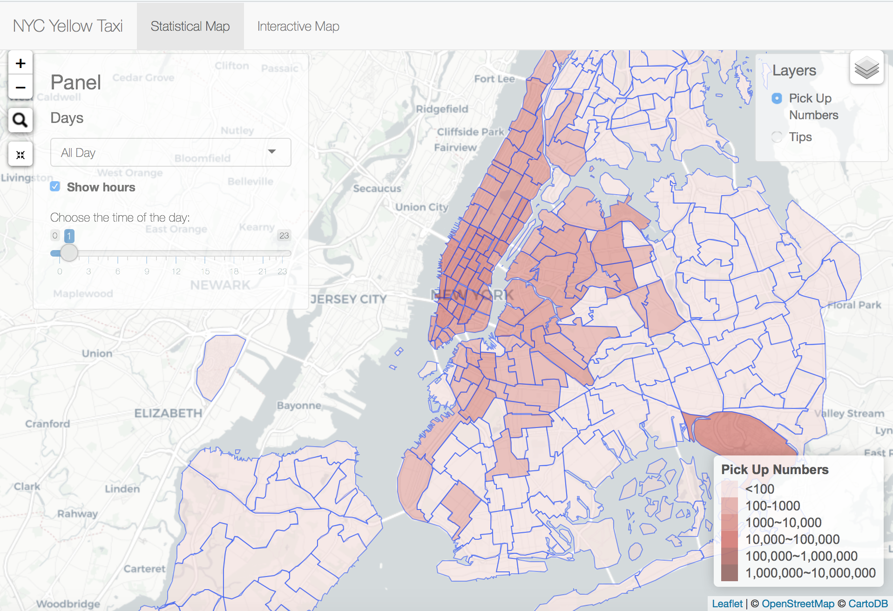

# Project 2: Shiny App Development Version 2.0

### [Project Description](doc/project2_desc.md)



In this second project of GR5243 Applied Data Science, we develop a version 2.0 of an *Exploratory Data Analysis and Visualization* shiny app on a topic of your choice using [NYC Open Data](https://opendata.cityofnewyork.us/) or U.S. government open data released on the [data.gov](https://data.gov/) website. See [Project 2 Description](doc/project2_desc.md) for more details.  

The **learning goals** for this project is:

- business intelligence for data science
- study legacy codes and further development
- data cleaning
- data visualization
- systems development/design life cycle
- shiny app/shiny server

*The above general statement about project 2 can be removed once you are finished with your project. It is optional.

## Project Title: 2018 NYC Yellow Taxi Shiny App 2.0
Term: Spring 2019

+ Team #9

+ Group members:
	+ Ziyi Liao
	+ Shengjie Sun
	+ Haiqing Xu
	+ Xinzhu Wang
	+ Shiwei Hua

+ **Project summary**: This Shiny app is an updated version of the app built by previous students. Our updated app is designed specifically for taxi drivers’ reference. This data visualization project can help answer questions such as:
What are the busiest hours in a certain taxi zone? Where do passengers usually go when they are picked up in a certain taxi zone and
what tip percentage do they give?

In this project, we updated data to be the latest 2018 yellow taxi trip records in New York City and analyzed 63.4 million records in total. Instead of using 195 neighborhood zones to divide the area in New York City, we used the 263 TLC taxi zones. An important new feature of this Shiny app 2.0 is the interactive map that shows drivers starting from a specific taxi zone, what the top 3 destinations are. That is to say, we hope to tell drivers if you pick up a passenger in a specific taxi zone, where are they likely to go? In the staistical map, drivers can see the number of pick-ups in each taxi zone by observing the color-coded map. In addition, we have calculated the average tip percentage for each taxi zone and added another "Tips" layer in the statistical map.

Generally, this upgraded app targets at taxi dirvers and provides relevant information for their interests.

+ **Contribution statement**: ([default](doc/a_note_on_contributions.md)) All team members participated in the design of the app. Haiqing carried out data pre-processing. Haiqing and Shengjie together completed the server part of the Shiny app. All team members contributed to the GitHub repository and prepared the presentation. All team members approve our work presented in our GitHub repository including this contribution statement.

Following [suggestions](http://nicercode.github.io/blog/2013-04-05-projects/) by [RICH FITZJOHN](http://nicercode.github.io/about/#Team) (@richfitz). This folder is orgarnized as follows.

```
proj/
├── app/
├── lib/
├── data/
├── doc/
└── output/
```

Please see each subfolder for a README file.

